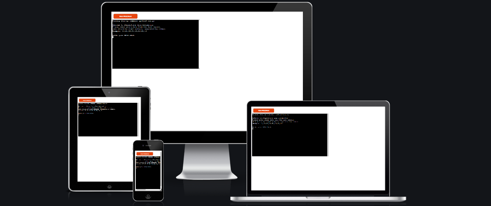
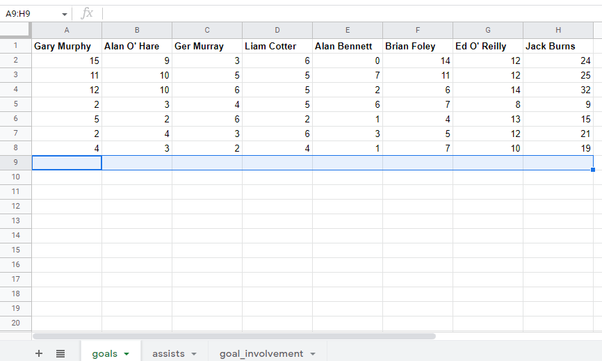
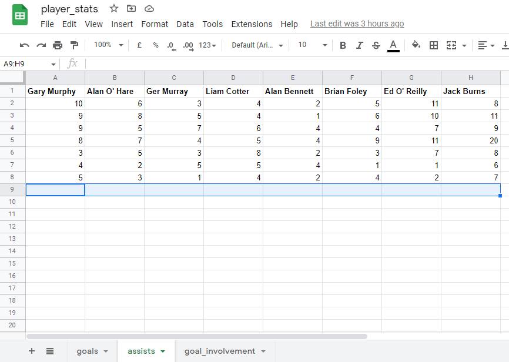
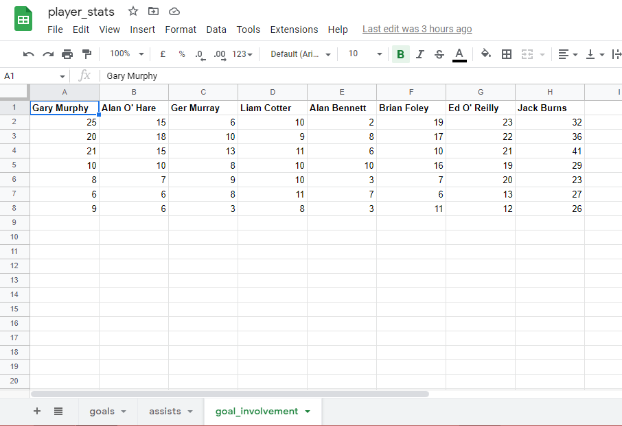
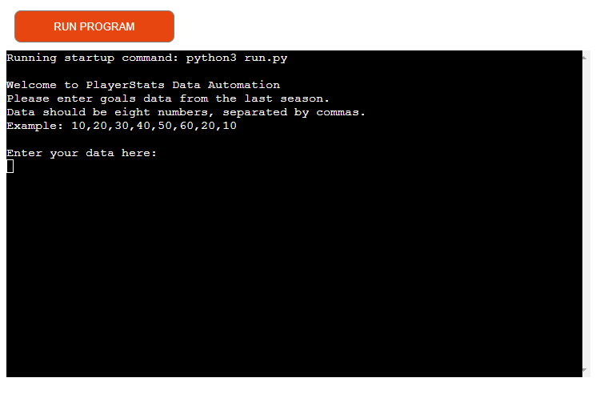
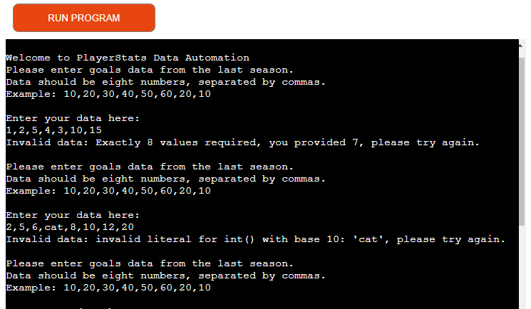
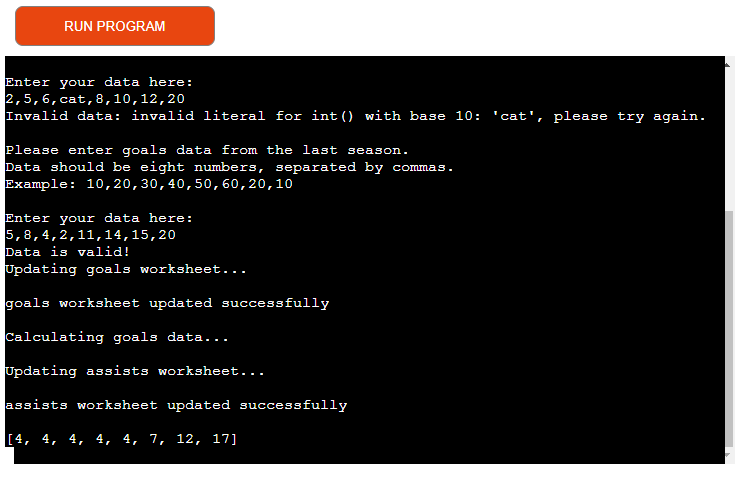

# Player Stats

[Live Site](https://playerstats21.herokuapp.com/) : [Google SpreadSheet](https://docs.google.com/spreadsheets/d/1a-geptm0pUIiS4hvhRsTyhaJOhbPlB-eqwekJ71BHqI/edit#gid=47386341)

## Description

Player Stats is a back end web application that utilises the template terminal supplied by Code Institute and runs in a mock teminal on Heroku.

## Features

Users can enter the amount of goals scored, goals assisted and their overall contribution to scores in a season to help keep track of their best performing players in a team.

## User Interface

- Welcomes the user and gives them information on the format and type of information to enter

- Accepts user input

- Input Validation and Error Checking

    - Prints error message if invalid data is entered or entered incorrectly
    - You must enter numbers only
    - You must enter the correct amount of numbers

- Repeats request for input until correct data and format is entered

- Spreadsheet is then updated

## Future Features

I would implement a feature so that the user could enter each players scores on a monthly by month basis as at present it only displays their total over a full season. This could then be incorporated to make month by month comparisons of goals scored etc. 
This would be more useful for a user like a team manager for example to make quicker decisions on situations where he may or may not need to bring in a new player.

## Testing

I manually tested the project by doing the following:

- Passed the code through the PEP8 validator and confirmed there are no problems

- Given invalid inputs: eg. incorrect amount of numbers, strings when numbers are expected

## Bug Fixes

Following passing the code through PEP8 validation I removed multiple trailing white spaces, reduced line length, and removed unneeded parentheses to ensure my code exhibited best coding practices.

## Validator Testing

- No errors were returned from PEP8online.com

## Deployment

The project was deployed using Code Institutes mock teminal for Heroku.

- Steps for deployment

    - Fork or clone this repository
    - Create a new Heroku app
    - Set the buildbacks to python and NodeJS in that order
    - Link the Heroku app to the repository
    - Click on deploy

## Credits

- My mentor at Code Institute for all of the support, calls and feedback throughout the project
- Code institute fir the deployment terminal  
- The Code Institute walkthrough project which this project is largely based on as well as the huge amount of lessons and tutorials as part of the full stack software development programme

